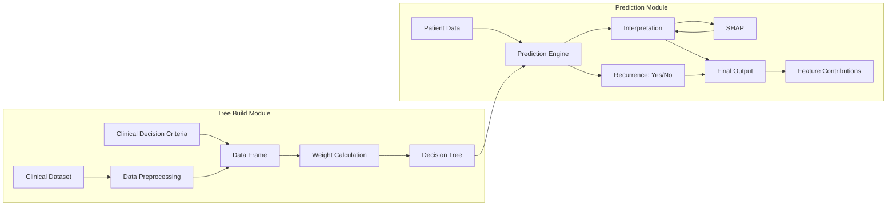

# Design Document: Clinical Decision Support System

## Overview

The Clinical Decision Support System is a machine learning-based architecture that assists healthcare professionals in making data-driven clinical decisions. The system consists of two primary modules:

1. **Tree Build Module**: Processes clinical datasets, applies clinical decision criteria, performs data preprocessing, calculates feature weights, and builds decision tree models
2. **Prediction Module**: Takes patient data and the trained decision tree to generate predictions, provide SHAP-based interpretations, assess recurrence risk, and calculate feature contributions

The system emphasizes interpretability through SHAP (SHapley Additive exPlanations) values, enabling clinicians to understand the reasoning behind each prediction.

## Architecture

### High-Level Architecture



### Component Architecture

The system follows a **pipeline-based architecture** with clear separation between training (Tree Build) and inference (Prediction):

- **Training Pipeline**: Clinical Dataset → Preprocessing → Feature Engineering → Model Training
- **Inference Pipeline**: Patient Data → Prediction → Interpretation → Output Generation

### Technology Stack

- **Data Processing**: pandas, NumPy for data manipulation
- **Machine Learning**: scikit-learn for decision tree implementation
- **Interpretability**: SHAP library for model explanations
- **Data Validation**: pydantic for schema validation
- **API Framework**: FastAPI for REST endpoints
- **Storage**: PostgreSQL for clinical data, file system for trained models
- **Monitoring**: Prometheus metrics, structured logging

## Components and Interfaces

### 1. Clinical Dataset Manager

**Responsibility**: Load, validate, and manage clinical datasets.

**Interface**:
```python
class ClinicalDatasetManager:
    def load_dataset(self, file_path: str, format: str = "csv") -> pd.DataFrame:
        """
        Load clinical dataset from file.
        
        Args:
            file_path: Path to dataset file
            format: File format ('csv', 'excel', 'json')
            
        Returns:
            DataFrame with clinical data
            
        Raises:
            FileNotFoundError: If file doesn't exist
            ValidationError: If data doesn't meet schema requirements
        """
        pass
    
    def validate_schema(self, df: pd.DataFrame) -> ValidationResult:
        """
        Validate dataset against clinical data schema.
        
        Args:
            df: DataFrame to validate
            
        Returns:
            ValidationResult with status and error details
        """
        pass
```

**Expected Schema**:
```python
from pydantic import BaseModel, Field
from typing import Optional

class ClinicalRecord(BaseModel):
    patient_id: str
    age: int = Field(ge=0, le=120)
    gender: str = Field(pattern="^(M|F|Other)$")
    diagnosis: str
    treatment_history: Optional[str]
    lab_results: dict
    vital_signs: dict
    outcome: Optional[str]  # For training data
    # Additional clinical features
```

### 2. Data Preprocessing

**Responsibility**: Clean, normalize, and transform clinical data for model training.

**Interface**:
```python
class DataPreprocessor:
    def preprocess(
        self, 
        raw_data: pd.DataFrame,
        clinical_criteria: dict
    ) -> pd.DataFrame:
        """
        Preprocess clinical data according to criteria.
        
        Args:
            raw_data: Raw clinical dataset
            clinical_criteria: Dictionary of preprocessing rules
            
        Returns:
            Preprocessed DataFrame ready for feature engineering
        """
        pass
    
    def handle_missing_values(
        self, 
        df: pd.DataFrame, 
        strategy: str = "median"
    ) -> pd.DataFrame:
        """
        Handle missing values in clinical data.
        
        Args:
            df: DataFrame with potential missing values
            strategy: 'median', 'mean', 'mode', or 'drop'
            
        Returns:
            DataFrame with missing values handled
        """
        pass
    
    def normalize_features(
        self, 
        df: pd.DataFrame, 
        method: str = "standard"
    ) -> pd.DataFrame:
        """
        Normalize numerical features.
        
        Args:
            df: DataFrame with features to normalize
            method: 'standard', 'minmax', or 'robust'
            
        Returns:
            DataFrame with normalized features
        """
        pass
```

**Preprocessing Steps**:
1. **Missing Value Handling**: Impute or remove records with missing critical values
2. **Outlier Detection**: Identify and handle statistical outliers in lab results
3. **Feature Encoding**: Convert categorical variables to numerical representations
4. **Normalization**: Scale numerical features to comparable ranges
5. **Feature Selection**: Remove irrelevant or redundant features

### 3. Clinical Decision Criteria Manager

**Responsibility**: Define and apply clinical decision rules and constraints.

**Interface**:
```python
class ClinicalCriteriaManager:
    def load_criteria(self, criteria_file: str) -> dict:
        """
        Load clinical decision criteria from configuration.
        
        Args:
            criteria_file: Path to criteria configuration file
            
        Returns:
            Dictionary of clinical criteria rules
        """
        pass
    
    def apply_criteria(
        self, 
        df: pd.DataFrame, 
        criteria: dict
    ) -> pd.DataFrame:
        """
        Apply clinical criteria to filter and transform data.
        
        Args:
            df: Clinical dataset
            criteria: Clinical decision criteria
            
        Returns:
            DataFrame with criteria applied
        """
        pass
```

**Criteria Configuration Example**:
```yaml
# clinical_criteria.yaml
inclusion_criteria:
  age_range: [18, 85]
  required_fields: ["diagnosis", "treatment_history"]
  
exclusion_criteria:
  diagnoses: ["terminal_illness", "palliative_care"]
  
feature_engineering:
  derived_features:
    - name: "bmi"
      formula: "weight / (height ** 2)"
    - name: "risk_score"
      formula: "age * 0.1 + comorbidity_count * 2"
      
feature_importance_weights:
  age: 1.0
  diagnosis: 2.0
  lab_results: 1.5
```

### 4. Weight Calculation Engine

**Responsibility**: Calculate feature importance weights for decision tree training.

**Interface**:
```python
class WeightCalculator:
    def calculate_weights(
        self, 
        df: pd.DataFrame, 
        target_column: str,
        method: str = "information_gain"
    ) -> dict:
        """
        Calculate feature importance weights.
        
        Args:
            df: Preprocessed clinical data
            target_column: Name of target variable
            method: 'information_gain', 'gini', or 'chi_square'
            
        Returns:
            Dictionary mapping feature names to importance weights
        """
        pass
    
    def apply_clinical_weights(
        self, 
        computed_weights: dict, 
        clinical_weights: dict
    ) -> dict:
        """
        Combine computed weights with clinical expert weights.
        
        Args:
            computed_weights: Statistically computed weights
            clinical_weights: Expert-defined clinical weights
            
        Returns:
            Combined weight dictionary
        """
        pass
```

**Weight Calculation Strategy**:
```python
def calculate_weights(df, target, method="information_gain"):
    if method == "information_gain":
        # Calculate entropy-based information gain
        weights = {}
        for feature in df.columns:
            if feature != target:
                weights[feature] = mutual_info_score(df[feature], df[target])
        return weights
    
    elif method == "gini":
        # Calculate Gini importance
        from sklearn.tree import DecisionTreeClassifier
        dt = DecisionTreeClassifier()
        dt.fit(df.drop(columns=[target]), df[target])
        return dict(zip(df.columns, dt.feature_importances_))
    
    # Normalize weights to sum to 1
    total = sum(weights.values())
    return {k: v/total for k, v in weights.items()}
```

### 5. Decision Tree Builder

**Responsibility**: Train and persist decision tree models.

**Interface**:
```python
class DecisionTreeBuilder:
    def build_tree(
        self,
        X: pd.DataFrame,
        y: pd.Series,
        weights: dict,
        hyperparameters: dict = None
    ) -> DecisionTreeModel:
        """
        Build decision tree model with feature weights.
        
        Args:
            X: Feature matrix
            y: Target variable
            weights: Feature importance weights
            hyperparameters: Model hyperparameters (max_depth, min_samples_split, etc.)
            
        Returns:
            Trained DecisionTreeModel
        """
        pass
    
    def optimize_hyperparameters(
        self,
        X: pd.DataFrame,
        y: pd.Series,
        param_grid: dict
    ) -> dict:
        """
        Perform hyperparameter optimization using cross-validation.
        
        Args:
            X: Feature matrix
            y: Target variable
            param_grid: Grid of hyperparameters to search
            
        Returns:
            Best hyperparameters found
        """
        pass
    
    def save_model(self, model: DecisionTreeModel, path: str):
        """Save trained model to disk."""
        pass
    
    def load_model(self, path: str) -> DecisionTreeModel:
        """Load trained model from disk."""
        pass
```

**Model Training Strategy**:
```python
from sklearn.tree import DecisionTreeClassifier
from sklearn.model_selection import GridSearchCV

def build_tree(X, y, weights, hyperparameters=None):
    # Default hyperparameters
    if hyperparameters is None:
        hyperparameters = {
            'max_depth': 10,
            'min_samples_split': 20,
            'min_samples_leaf': 10,
            'criterion': 'gini'
        }
    
    # Apply feature weights through sample weights or feature selection
    sample_weights = compute_sample_weights(X, weights)
    
    # Train decision tree
    dt = DecisionTreeClassifier(**hyperparameters)
    dt.fit(X, y, sample_weight=sample_weights)
    
    return dt
```

### 6. Prediction Engine

**Responsibility**: Generate predictions for new patient data using trained decision tree.

**Interface**:
```python
class PredictionEngine:
    def __init__(self, model_path: str):
        """Initialize with trained model."""
        self.model = self.load_model(model_path)
        self.explainer = shap.TreeExplainer(self.model)
    
    def predict(self, patient_data: dict) -> PredictionResult:
        """
        Generate prediction for patient.
        
        Args:
            patient_data: Dictionary of patient features
            
        Returns:
            PredictionResult with prediction and confidence
        """
        pass
    
    def predict_proba(self, patient_data: dict) -> dict:
        """
        Generate probability estimates for each class.
        
        Args:
            patient_data: Dictionary of patient features
            
        Returns:
            Dictionary mapping class labels to probabilities
        """
        pass
```

**Prediction Result Schema**:
```python
from dataclasses import dataclass

@dataclass
class PredictionResult:
    patient_id: str
    prediction: str  # "Yes" or "No" for recurrence
    confidence: float  # 0-1 probability
    risk_level: str  # "Low", "Medium", "High"
    timestamp: str
```

### 7. SHAP Interpretation Engine

**Responsibility**: Generate interpretable explanations for predictions using SHAP values.

**Interface**:
```python
class SHAPInterpreter:
    def __init__(self, model, background_data: pd.DataFrame):
        """
        Initialize SHAP explainer.
        
        Args:
            model: Trained decision tree model
            background_data: Representative sample for SHAP baseline
        """
        self.explainer = shap.TreeExplainer(model, background_data)
    
    def explain_prediction(
        self, 
        patient_data: pd.DataFrame
    ) -> SHAPExplanation:
        """
        Generate SHAP explanation for prediction.
        
        Args:
            patient_data: Patient features as DataFrame
            
        Returns:
            SHAPExplanation with feature contributions
        """
        pass
    
    def get_feature_contributions(
        self, 
        shap_values: np.ndarray,
        feature_names: list
    ) -> dict:
        """
        Extract feature contributions from SHAP values.
        
        Args:
            shap_values: SHAP values array
            feature_names: List of feature names
            
        Returns:
            Dictionary mapping features to contribution scores
        """
        pass
    
    def generate_visualization(
        self, 
        shap_values: np.ndarray,
        patient_data: pd.DataFrame
    ) -> str:
        """
        Generate SHAP visualization (waterfall or force plot).
        
        Args:
            shap_values: SHAP values for patient
            patient_data: Patient features
            
        Returns:
            Base64-encoded visualization image
        """
        pass
```

**SHAP Explanation Schema**:
```python
@dataclass
class SHAPExplanation:
    base_value: float  # Model's baseline prediction
    shap_values: dict  # Feature -> SHAP value mapping
    feature_contributions: dict  # Feature -> contribution percentage
    top_features: list  # Top 5 most influential features
    visualization: str  # Base64-encoded plot
```

**SHAP Calculation Example**:
```python
import shap

def explain_prediction(model, patient_data, background_data):
    # Create explainer
    explainer = shap.TreeExplainer(model, background_data)
    
    # Calculate SHAP values
    shap_values = explainer.shap_values(patient_data)
    
    # Extract contributions
    contributions = {}
    for i, feature in enumerate(patient_data.columns):
        contributions[feature] = {
            'shap_value': float(shap_values[0][i]),
            'feature_value': patient_data.iloc[0][i],
            'contribution_pct': abs(shap_values[0][i]) / sum(abs(shap_values[0]))
        }
    
    # Sort by absolute contribution
    top_features = sorted(
        contributions.items(), 
        key=lambda x: abs(x[1]['shap_value']), 
        reverse=True
    )[:5]
    
    return {
        'base_value': explainer.expected_value,
        'shap_values': contributions,
        'top_features': [f[0] for f in top_features]
    }
```

### 8. Recurrence Assessment

**Responsibility**: Determine recurrence risk level based on prediction and clinical thresholds.

**Interface**:
```python
class RecurrenceAssessor:
    def assess_recurrence(
        self, 
        prediction_proba: float,
        patient_features: dict,
        thresholds: dict = None
    ) -> RecurrenceAssessment:
        """
        Assess recurrence risk level.
        
        Args:
            prediction_proba: Probability of recurrence (0-1)
            patient_features: Patient clinical features
            thresholds: Risk level thresholds
            
        Returns:
            RecurrenceAssessment with risk level and recommendations
        """
        pass
```

**Risk Level Thresholds**:
```python
DEFAULT_THRESHOLDS = {
    'low': (0.0, 0.3),      # 0-30% probability
    'medium': (0.3, 0.7),   # 30-70% probability
    'high': (0.7, 1.0)      # 70-100% probability
}

@dataclass
class RecurrenceAssessment:
    recurrence_prediction: str  # "Yes" or "No"
    probability: float
    risk_level: str  # "Low", "Medium", "High"
    confidence_interval: tuple  # (lower, upper) bounds
    clinical_recommendations: list
```

### 9. Output Generator

**Responsibility**: Format and package prediction results with interpretations.

**Interface**:
```python
class OutputGenerator:
    def generate_output(
        self,
        prediction: PredictionResult,
        shap_explanation: SHAPExplanation,
        recurrence_assessment: RecurrenceAssessment
    ) -> ClinicalOutput:
        """
        Generate comprehensive clinical output.
        
        Args:
            prediction: Prediction result
            shap_explanation: SHAP interpretation
            recurrence_assessment: Recurrence risk assessment
            
        Returns:
            ClinicalOutput with all results formatted
        """
        pass
    
    def export_report(
        self, 
        output: ClinicalOutput, 
        format: str = "json"
    ) -> str:
        """
        Export output in specified format.
        
        Args:
            output: Clinical output object
            format: 'json', 'pdf', or 'html'
            
        Returns:
            Formatted report string or file path
        """
        pass
```

**Clinical Output Schema**:
```python
@dataclass
class ClinicalOutput:
    patient_id: str
    timestamp: str
    
    # Prediction
    recurrence_prediction: str
    probability: float
    risk_level: str
    confidence_interval: tuple
    
    # Interpretation
    base_prediction: float
    feature_contributions: dict
    top_influential_features: list
    shap_visualization: str
    
    # Clinical Context
    clinical_recommendations: list
    follow_up_actions: list
    
    # Metadata
    model_version: str
    prediction_confidence: float
```

## Data Models

### Core Data Models

```python
from dataclasses import dataclass
from typing import List, Dict, Optional
from datetime import datetime

@dataclass
class ClinicalDataset:
    """Clinical training dataset."""
    dataset_id: str
    name: str
    records: pd.DataFrame
    metadata: Dict[str, any]
    created_at: datetime
    record_count: int
    feature_count: int

@dataclass
class PreprocessedData:
    """Preprocessed clinical data."""
    data: pd.DataFrame
    preprocessing_steps: List[str]
    missing_value_strategy: str
    normalization_method: str
    feature_names: List[str]

@dataclass
class FeatureWeights:
    """Feature importance weights."""
    weights: Dict[str, float]
    calculation_method: str
    clinical_adjustments: Dict[str, float]
    normalized: bool

@dataclass
class DecisionTreeModel:
    """Trained decision tree model."""
    model_id: str
    sklearn_model: any  # sklearn DecisionTreeClassifier
    feature_names: List[str]
    target_name: str
    hyperparameters: Dict[str, any]
    training_metrics: Dict[str, float]
    created_at: datetime

@dataclass
class PatientData:
    """Individual patient data for prediction."""
    patient_id: str
    features: Dict[str, any]
    timestamp: datetime
    source: str  # "ehr", "manual_entry", etc.
```

## Correctness Properties

### Property 1: Data Schema Validation
- **Validates**: All clinical data must conform to defined schema
- **Property**: For all datasets D, validate_schema(D) returns True or raises ValidationError
- **Test Strategy**: Generate valid and invalid datasets, verify validation behavior

### Property 2: Preprocessing Idempotence
- **Validates**: Preprocessing preprocessed data doesn't change it
- **Property**: For all preprocessed data P, preprocess(P) == P
- **Test Strategy**: Preprocess data twice, verify equality

### Property 3: Weight Normalization
- **Validates**: Feature weights sum to 1.0
- **Property**: For all weight dictionaries W, sum(W.values()) == 1.0 (within epsilon)
- **Test Strategy**: Calculate weights for various datasets, verify sum

### Property 4: Prediction Probability Bounds
- **Validates**: Prediction probabilities are valid
- **Property**: For all predictions P, 0 <= P.probability <= 1
- **Test Strategy**: Generate predictions for diverse inputs, verify bounds

### Property 5: SHAP Value Conservation
- **Validates**: SHAP values sum to prediction difference from baseline
- **Property**: For all explanations E, sum(E.shap_values) + E.base_value ≈ prediction
- **Test Strategy**: Generate SHAP explanations, verify conservation property

### Property 6: Risk Level Consistency
- **Validates**: Risk level matches probability thresholds
- **Property**: For all assessments A, risk_level(A) consistent with probability(A)
- **Test Strategy**: Generate assessments across probability range, verify consistency

### Property 7: Feature Contribution Sum
- **Validates**: Feature contributions sum to 100%
- **Property**: For all explanations E, sum(E.feature_contributions.values()) ≈ 1.0
- **Test Strategy**: Generate explanations, verify contribution sum

### Property 8: Model Determinism
- **Validates**: Same input produces same output
- **Property**: For all patient data P, predict(P) == predict(P)
- **Test Strategy**: Make multiple predictions for same input, verify equality

### Property 9: Missing Value Handling
- **Validates**: No NaN values after preprocessing
- **Property**: For all preprocessed data P, not P.data.isnull().any().any()
- **Test Strategy**: Preprocess data with missing values, verify no NaNs remain

### Property 10: Model Serialization Integrity
- **Validates**: Saved and loaded models produce identical predictions
- **Property**: For all models M and data D, predict(M, D) == predict(load(save(M)), D)
- **Test Strategy**: Save/load models, compare predictions

## Testing Strategy

### Testing Framework
- **Unit Tests**: pytest for component testing
- **Property-Based Tests**: Hypothesis for generative testing
- **Integration Tests**: End-to-end pipeline testing
- **Clinical Validation**: Expert review of predictions on test cases

### Test Organization
```
tests/
├── unit/
│   ├── test_dataset_manager.py
│   ├── test_preprocessor.py
│   ├── test_weight_calculator.py
│   ├── test_tree_builder.py
│   ├── test_prediction_engine.py
│   ├── test_shap_interpreter.py
│   └── test_output_generator.py
├── integration/
│   ├── test_training_pipeline.py
│   ├── test_prediction_pipeline.py
│   └── test_api_endpoints.py
├── properties/
│   ├── test_data_properties.py
│   ├── test_model_properties.py
│   └── test_prediction_properties.py
└── clinical/
    ├── test_clinical_scenarios.py
    └── test_expert_validation.py
```

### Coverage Requirements
- Minimum 85% code coverage for all components
- 100% coverage for prediction and interpretation logic
- Clinical validation on diverse patient scenarios

## API Specification

### REST API Endpoints

**Train Model**:
```
POST /api/v1/models/train
Content-Type: application/json

Request:
{
  "dataset_path": "path/to/clinical_data.csv",
  "clinical_criteria": {...},
  "hyperparameters": {...}
}

Response:
{
  "model_id": "uuid",
  "status": "training",
  "estimated_time_seconds": 120
}
```

**Get Model Status**:
```
GET /api/v1/models/{model_id}/status

Response:
{
  "model_id": "uuid",
  "status": "completed",
  "metrics": {
    "accuracy": 0.87,
    "precision": 0.85,
    "recall": 0.89,
    "f1_score": 0.87
  }
}
```

**Make Prediction**:
```
POST /api/v1/predictions
Content-Type: application/json

Request:
{
  "model_id": "uuid",
  "patient_data": {
    "patient_id": "P12345",
    "age": 65,
    "gender": "M",
    "diagnosis": "...",
    ...
  }
}

Response:
{
  "patient_id": "P12345",
  "recurrence_prediction": "No",
  "probability": 0.23,
  "risk_level": "Low",
  "confidence_interval": [0.18, 0.28],
  "feature_contributions": {...},
  "top_influential_features": [...],
  "clinical_recommendations": [...]
}
```

**Get SHAP Explanation**:
```
GET /api/v1/predictions/{prediction_id}/explanation

Response:
{
  "base_value": 0.35,
  "shap_values": {...},
  "feature_contributions": {...},
  "visualization": "data:image/png;base64,..."
}
```

## Implementation Considerations

### Model Training Pipeline

```python
def train_model_pipeline(dataset_path, clinical_criteria, hyperparameters):
    # 1. Load dataset
    dataset_manager = ClinicalDatasetManager()
    raw_data = dataset_manager.load_dataset(dataset_path)
    
    # 2. Validate schema
    validation = dataset_manager.validate_schema(raw_data)
    if not validation.is_valid:
        raise ValidationError(validation.errors)
    
    # 3. Preprocess data
    preprocessor = DataPreprocessor()
    preprocessed = preprocessor.preprocess(raw_data, clinical_criteria)
    
    # 4. Calculate weights
    weight_calculator = WeightCalculator()
    weights = weight_calculator.calculate_weights(
        preprocessed, 
        target_column="outcome"
    )
    
    # 5. Build decision tree
    tree_builder = DecisionTreeBuilder()
    X = preprocessed.drop(columns=["outcome"])
    y = preprocessed["outcome"]
    model = tree_builder.build_tree(X, y, weights, hyperparameters)
    
    # 6. Save model
    model_id = str(uuid.uuid4())
    tree_builder.save_model(model, f"models/{model_id}.pkl")
    
    return model_id, model
```

### Prediction Pipeline

```python
def prediction_pipeline(model_id, patient_data):
    # 1. Load model
    prediction_engine = PredictionEngine(f"models/{model_id}.pkl")
    
    # 2. Validate patient data
    validated_data = validate_patient_data(patient_data)
    
    # 3. Generate prediction
    prediction = prediction_engine.predict(validated_data)
    proba = prediction_engine.predict_proba(validated_data)
    
    # 4. Generate SHAP explanation
    shap_interpreter = SHAPInterpreter(prediction_engine.model, background_data)
    explanation = shap_interpreter.explain_prediction(validated_data)
    
    # 5. Assess recurrence risk
    assessor = RecurrenceAssessor()
    assessment = assessor.assess_recurrence(
        proba["Yes"], 
        validated_data
    )
    
    # 6. Generate output
    output_generator = OutputGenerator()
    output = output_generator.generate_output(
        prediction, 
        explanation, 
        assessment
    )
    
    return output
```

### Deployment Architecture

**Docker Compose Setup**:
```yaml
services:
  api:
    image: clinical-decision-api:latest
    ports:
      - "8000:8000"
    environment:
      - DATABASE_URL=postgresql://...
      - MODEL_STORAGE_PATH=/models
    volumes:
      - ./models:/models
    depends_on:
      - postgres
  
  postgres:
    image: postgres:15
    volumes:
      - pgdata:/var/lib/postgresql/data
    environment:
      - POSTGRES_DB=clinical_db
      - POSTGRES_USER=clinical_user
      - POSTGRES_PASSWORD=secure_password
```

### Security Considerations

1. **Data Privacy**: All patient data must be encrypted at rest and in transit
2. **Access Control**: Role-based access control for API endpoints
3. **Audit Logging**: All predictions logged with timestamps and user IDs
4. **Model Versioning**: Track model versions for reproducibility
5. **HIPAA Compliance**: Ensure all data handling meets HIPAA requirements

### Performance Optimization

1. **Model Caching**: Cache loaded models in memory
2. **Batch Predictions**: Support batch prediction requests
3. **Async Processing**: Use async/await for I/O operations
4. **Database Indexing**: Index patient_id and timestamp columns
5. **SHAP Caching**: Cache SHAP explainer for repeated use

## Conclusion

This design provides a comprehensive clinical decision support system with strong emphasis on interpretability through SHAP explanations. The modular architecture ensures maintainability and extensibility, while property-based testing guarantees correctness across all components.
